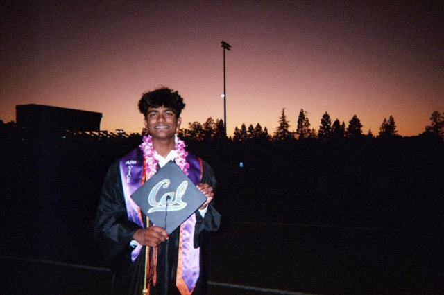

+++
title = 'About'
date = 2024-12-16T11:30:04+01:00
draft = false
image = "images/DSCN0038Small.jpg"
+++

# About Me

I'm Neil Thomas, an Electrical Engineering and Computer Science student at UC Berkeley with a passion for developing innovative solutions through technology.

## Education

I'm currently pursuing my B.S. in Electrical Engineering and Computer Science with a minor in Pure Mathematics at the University of California, Berkeley. Currently exploring artificial intelligence, machine learning, software engineering, NLP, algorithms, and high frequency trading. :)

## Professional Experience

My professional journey spans research, software engineering, and entrepreneurship:

- As a Research Assistant at Berkeley AI Research's Mobile Sensing Lab, I'm exploring efficient traffic flow using autonomous vehicles and reinforcement learning.
- With Arista Networks, I've developed AI documentation tools using LLMs and vector indexing.
- At Stealth Startup, I've engineering real-time applications with Flutter and Dart.
- At Cascade I've programmed end-to-end financial and compliance infrastructure for real estate funds.

## Technical Skills

I work with various technologies including:

- Languages: Python, C++, R, Java, Go, Ruby, HTML/CSS, MySQL, NodeJS, ReactJS, React Native, Solidity, Rust, Firebase, MongoDB
- Frameworks: Next.js, Keras, Pandas, Lang Chain, Rest API, Pytorch, CUDA AI/ML: PyTorch, TensorFlow, OpenCV 
- Tools:  Linux, Git, NumPy, SciPy, Scikit-Learn, Pandas, jQuery, Arduino, Matplotlib, Flask, ArcGIS, MATLAB, JSON, PySpark

## Connect With Me

Feel free to reach out via [email](mailto:neilthomas@berkeley.edu) or connect with me on [LinkedIn](https://linkedin.com/in/neiltthomas).